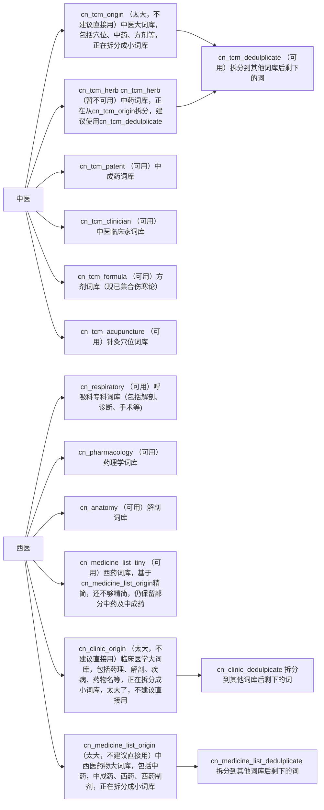

[简体中文](https://github.com/whitewatercn/rime_clinic/blob/master/README.md)  | [English](./docs/README_en.md)

# 项目介绍

中英医学词库，欢迎补充修改提意见！

# 中文词库（位于 `clinic_dicts/cn_dict`文件夹）

[详细介绍点此查看](./docs/dict_info.md)

简略介绍

# 英文词库（位于 `clinic_dicts/en_dict`文件夹）

[详细介绍点此查看](./docs/dict_info.md)

# 感谢

- [深蓝词库转换](https://github.com/studyzy/imewlconverter)：本仓库的很多词库由搜狗等词库使用该工具转换而来，使用方法见[如何在Linux上使用深蓝词库转换（以Google colab为例——基于Ubuntu）](https://forum.beginner.center/t/topic/719)
- [rime-ice](https://github.com/iDvel/rime-ice)：该项目作者提供了rime相关的很多帮助
- [rime-frost](https://github.com/gaboolic/rime-frost)：该项目基于rime-ice进行了很多词库优化
- [hallelujahIM(哈利路亚英文输入法)](https://github.com/dongyuwei/hallelujahIM) ：该项目直接提供了 `google.dict.yaml`词库来源
- [rimetool](https://github.com/whitewatercn/rimetool)：为了满足更多需求，本人开发的多功能rime工具
- [RIME-LMDG](https://github.com/amzxyz/RIME-LMDG)：基于32GB超大规模语料的RIME中文语法模型与词库构建

# 版权

词库收集自互联网公开信息，如侵犯版权请联系删除

## Star History

