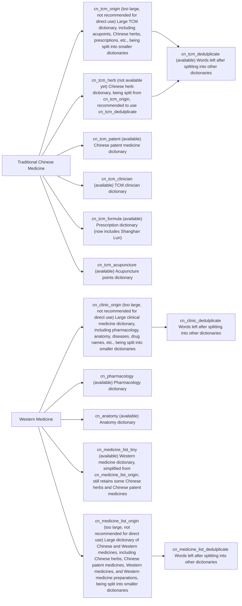
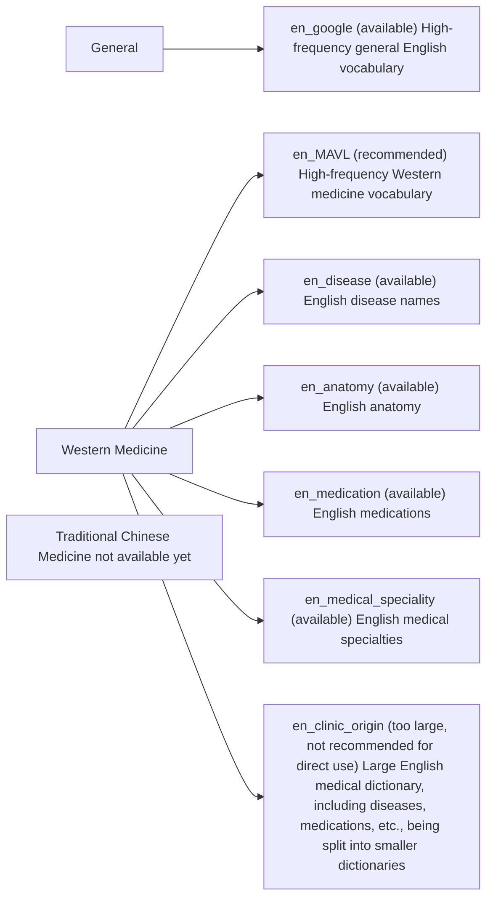

[Simplified Chinese](https://github.com/whitewatercn/rime_clinic/blob/master/README.md)  | [English](https://github.com/whitewatercn/rime_clinic/blob/master/docs/README_en.md) 

# Project Introduction

Rime Chinese-English Medical Dictionary. Contributions are welcome!

This project has been integrated into [rilinic Medical Input Method](https://github.com/whitewatercn/rilinic). You can directly use rilinic, an easy-to-use input method designed for medical practitioners.

# Chinese Dictionary (located in the `cn_dict` folder)

[Click here for detailed introduction](https://github.com/whitewatercn/rime_clinic/blob/master/docs/dict_info.md)

⚠️Note⚠️ Please mount the dictionaries one by one and then deploy. Mounting and deploying multiple large dictionaries at once can occupy a large amount of memory and cause the computer to freeze.

# English Dictionary (located in the `en_dict` folder)

[Click here for detailed introduction](./docs/dict_info.md)

⚠️Note⚠️ Please mount the dictionaries one by one and then deploy. Mounting and deploying multiple large dictionaries at once can occupy a large amount of memory and cause the computer to freeze.

⚠️Note⚠️ Please mount the dictionaries one by one and then deploy. Mounting and deploying multiple large dictionaries at once can occupy a large amount of memory and cause the computer to freeze.

# Acknowledgements

- [Deep Blue Dictionary Converter](https://github.com/studyzy/imewlconverter): Many dictionaries in this repository were converted from Sogou and other dictionaries using this tool. For usage, see [How to use Deep Blue Dictionary Converter on Linux (example with Google Colab - based on Ubuntu)](https://forum.beginner.center/t/topic/719)
- [rime-ice](https://github.com/iDvel/rime-ice): The author of this project provided a lot of help related to Rime.
- [hallelujahIM (Hallelujah English Input Method)](https://github.com/dongyuwei/hallelujahIM): This project directly provided the source of the `google.dict.yaml` dictionary.
- [Rimetool](https://github.com/whitewatercn/rimetool): A multifunctional Rime tool developed by me to meet more needs.
- 

# Copyright

Dictionaries are collected from publicly available information on the internet. If there is any copyright infringement, please contact us for removal.

## Star History

